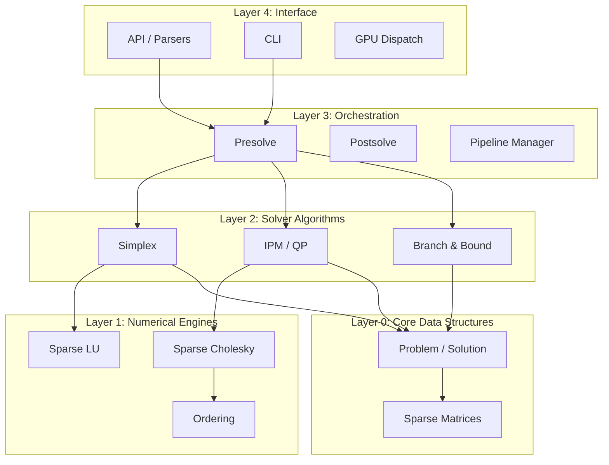
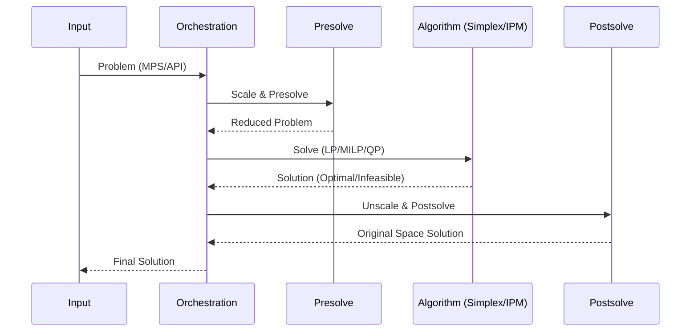

# Suplex Architecture

## 1. High-Level Architecture
Suplex is built on a modular, layered architecture ensuring clean separation between data representation, numerical computation, optimization algorithms, and external interfaces.

- **Layer 0: Core Data Structures** (sparse matrices, problem representation, solution)
- **Layer 1: Numerical Engines** (sparse LU, sparse Cholesky, ordering)
- **Layer 2: Solver Algorithms** (simplex, IPM, QP, B&B)
- **Layer 3: Orchestration** (presolve → solve → postsolve pipeline)
- **Layer 4: Interface** (parsers, API, CLI, GPU dispatch)



## 2. Problem Representation
The primary optimization problem is structurally general, designed to minimize slack variable explosion.

```cpp
struct Problem {
    int num_rows;           // m constraints
    int num_cols;           // n variables
    SparseMatrixCSC A;      // m × n constraint matrix
    std::vector<double> c;  // n-vector objective coefficients
    std::vector<double> b;  // m-vector right-hand sides
    std::vector<double> col_lower; // n-vector variable lower bounds
    std::vector<double> col_upper; // n-vector variable upper bounds
    std::vector<double> row_lower; // m-vector constraint lower bounds
    std::vector<double> row_upper; // m-vector constraint upper bounds
    std::vector<VarType> var_type;  // CONTINUOUS, INTEGER, BINARY
    ObjectiveSense sense;   // MINIMIZE or MAXIMIZE
    // For QP: optional Q matrix (symmetric positive semidefinite)
    std::optional<SparseMatrixCSC> Q;
};
```
**Why ranged rows?**
Instead of enforcing a standard equality form `Ax = b` natively in the interface, we use ranged bounds (`row_lower` and `row_upper`). This is more general and critically avoids the explosion of slack variables during model building. Algorithms will handle slacks internally if required.

## 3. Sparse Matrix Design
Efficient linear algebra relies heavily on proper sparse data formats.

- **CSC (Compressed Sparse Column):** Used heavily for column-oriented operations (e.g., simplex pricing, basis updates). Memory layout: `values`, `row_indices`, `col_pointers`.
- **CSR (Compressed Sparse Row):** Used for row operations (e.g., constraint evaluation, presolve). Memory layout: `values`, `col_indices`, `row_pointers`.
- **Triplet Format (COO):** Used primarily for easy construction and file parsing before compressing to CSC/CSR.
- **Conversion Routines:** Native functions available for fast transposition and format switching.
- **Memory Patterns:** Continuous arrays heavily optimized for cache-friendly access patterns.

## 4. Solver Pipeline
The standard execution pipeline handles everything from problem ingestion to post-solution mapping.

**Detailed Flow:**
```text
Input (MPS/LP/API) → Problem construction → Scaling → Presolve → 
  ├── LP: Simplex or IPM → Crossover (if IPM) → Postsolve → Solution
  ├── MILP: Root LP relaxation → Cuts → Branch-and-Bound → Postsolve → Solution  
  └── QP: IPM-QP → Crossover → Postsolve → Solution
```

**Sequence Diagram:**


## 5. Memory Management Strategy
- **Arena Allocator:** Used for B&B tree nodes. Supports bulk allocation/deallocation per subtree for fast tree management.
- **Column-Major Storage:** Default layout for dense basis matrix operations, ensuring CPU cache efficiency.
- **Memory Pools:** Used for temporary vectors allocated and deallocated repeatedly in simplex iterations.
- **GPU Memory:** Leverages pinned host memory for asynchronous DMA transfers to device memory pools.

## 6. Parallelism Strategy
- **Thread-Level (CPU):** OpenMP is used for independent sparse matrix operations (SpMV, scaling, presolve loops).
- **Task-Level (CPU):** Thread pools process independent nodes during Branch-and-Bound execution.
- **GPU Acceleration:** CUDA streams are used extensively to overlap computation (e.g., dense kernel execution) with data transfer.
- **No MPI:** MVP focuses on a powerful single-node architecture (scale-up rather than scale-out).

## 7. Error Handling
- The solver fundamentally relies on the `SolverStatus` enum: `OPTIMAL`, `INFEASIBLE`, `UNBOUNDED`, `ITERATION_LIMIT`, `TIME_LIMIT`, `NUMERICAL_ERROR`.
- **No Exceptions:** In the solver core, functions do not throw exceptions. Control flow strictly uses status codes or `std::expected`.
- **Logging:** Configurable logging framework with levels: `TRACE`, `DEBUG`, `INFO`, `WARN`, `ERROR`.

## 8. Extensibility Points
- **Plugin Architecture:** For custom cutting plane generators.
- **Callback Interface:** B&B allows users to hook into nodes to inspect data and inject lazy constraints.
- **Custom Branching:** Branching strategies can be implemented via a virtual interface.
- **Custom Heuristics:** Framework supports easy registration of user-defined primal heuristics.
