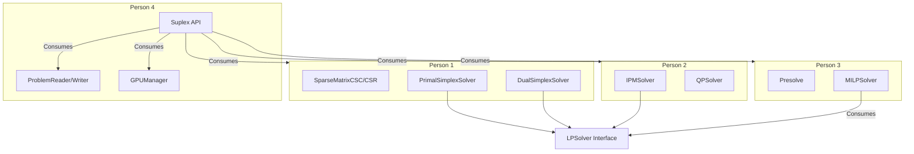

# Suplex Shared Interfaces

This document defines every C++ interface, abstract class, enum, and data structure that crosses module boundaries for the Suplex optimization solver. This file serves as the CONTRACT for the team — adhering to these interfaces ensures clean system integration.

Project: Suplex
Language: C++20

## 1. Common Types (`src/core/types.h`)

```cpp
#pragma once
#include <cstdint>
#include <limits>

namespace suplex {

// Floating point type used throughout the solver
using Real = double;
using Index = int32_t;

// Constants
constexpr Real INF = 1e30;
constexpr Real EPS_ZERO = 1e-12;
constexpr Real EPS_PIVOT = 1e-10;
constexpr Real EPS_FEASIBILITY = 1e-8;
constexpr Real EPS_OPTIMALITY = 1e-8;
constexpr Real EPS_INTEGER = 1e-6;
constexpr Index MAX_ITER = 1000000;
constexpr Real TIME_LIMIT = 3600.0;

enum class ObjectiveSense : uint8_t { MINIMIZE, MAXIMIZE };
enum class VarType : uint8_t { CONTINUOUS, INTEGER, BINARY };
enum class BoundType : uint8_t { FREE, LOWER, UPPER, BOTH, FIXED };

enum class SolverStatus : uint8_t {
    NOT_STARTED,
    OPTIMAL,
    INFEASIBLE,
    UNBOUNDED,
    INF_OR_UNBD,
    ITERATION_LIMIT,
    TIME_LIMIT,
    NUMERICAL_ERROR,
    USER_INTERRUPT
};

enum class LogLevel : uint8_t { TRACE, DEBUG, INFO, WARN, ERROR, OFF };

} // namespace suplex
```

### Type Explanations
- **`Index` (`int32_t`)**: Used for matrix indexing and dimensions. `int32_t` is sufficient to address over 2 billion elements, easily accommodating millions of variables and constraints. Using 32-bit integers instead of 64-bit improves CPU cache utilization and memory bandwidth, which is crucial for sparse matrix operations.
- **`Real` (`double`)**: Standard 64-bit IEEE 754 floating-point type. Numerical optimization relies on high precision to avoid catastrophic cancellation and maintain numerical stability during pivots, factorizations, and iterative solves.

## 2. Sparse Matrix Interface (`src/core/sparse_matrix.h`)

The core matrix representations used throughout the solver.

### SparseMatrixCSC (Compressed Sparse Column)
Optimal for column-oriented operations standard in Simplex.

```cpp
struct SparseMatrixCSC {
    Index num_rows;
    Index num_cols;
    Index nnz;                       // number of non-zeros
    std::vector<Index> col_start;    // size num_cols+1
    std::vector<Index> row_index;    // size nnz
    std::vector<Real> values;        // size nnz
    
    // Column access
    Index col_begin(Index j) const;
    Index col_end(Index j) const;
    Index col_length(Index j) const;
    
    // Operations (Person 1 implements)
    void multiply_vec(const Real* x, Real* y) const;           // y = A*x
    void multiply_transpose_vec(const Real* x, Real* y) const; // y = A^T*x
    void multiply_col(Index j, Real scalar, Real* y) const;    // y += scalar * A[:,j]
    Real dot_col(Index j, const Real* x) const;                // A[:,j]^T * x
    
    // Construction
    static SparseMatrixCSC from_triplets(Index nrows, Index ncols,
        const std::vector<Index>& rows, const std::vector<Index>& cols,
        const std::vector<Real>& vals);
    SparseMatrixCSR to_csr() const;
};
```

### SparseMatrixCSR (Compressed Sparse Row)
Useful for row-oriented operations, presolve, and certain GPU routines.

```cpp
struct SparseMatrixCSR {
    Index num_rows;
    Index num_cols;
    Index nnz;
    std::vector<Index> row_start;    // size num_rows+1
    std::vector<Index> col_index;    // size nnz
    std::vector<Real> values;        // size nnz
    
    Index row_begin(Index i) const;
    Index row_end(Index i) const;
    Index row_length(Index i) const;
    
    void multiply_vec(const Real* x, Real* y) const;
    SparseMatrixCSC to_csc() const;
};
```

### TripletMatrix (for construction)
Intermediate format for building sparse matrices incrementally.

```cpp
struct TripletMatrix {
    Index num_rows;
    Index num_cols;
    std::vector<Index> rows;
    std::vector<Index> cols;
    std::vector<Real> values;
    
    void add_entry(Index row, Index col, Real val);
    void reserve(Index nnz);
    SparseMatrixCSC to_csc() const;
};
```

## 3. Problem Interface (`src/core/problem.h`)

Central structure defining a mathematical optimization problem.

```cpp
class Problem {
public:
    // Dimensions
    Index num_rows() const;
    Index num_cols() const;
    Index num_integers() const;  // count of INTEGER + BINARY vars
    bool is_mip() const;         // has any integer variables?
    bool is_qp() const;          // has Q matrix?
    
    // Data access (const refs)
    const SparseMatrixCSC& constraint_matrix() const;  // A
    const std::vector<Real>& objective() const;         // c
    const std::vector<Real>& col_lower() const;
    const std::vector<Real>& col_upper() const;
    const std::vector<Real>& row_lower() const;
    const std::vector<Real>& row_upper() const;
    const std::vector<VarType>& var_types() const;
    ObjectiveSense sense() const;
    const SparseMatrixCSC* quadratic_objective() const; // nullptr if LP
    
    // Construction (Person 4 uses when parsing)
    void set_dimensions(Index rows, Index cols);
    void set_objective_sense(ObjectiveSense s);
    void set_constraint_matrix(SparseMatrixCSC&& A);
    void set_objective(std::vector<Real>&& c);
    void set_col_bounds(std::vector<Real>&& lower, std::vector<Real>&& upper);
    void set_row_bounds(std::vector<Real>&& lower, std::vector<Real>&& upper);
    void set_var_types(std::vector<VarType>&& types);
    void set_quadratic_objective(SparseMatrixCSC&& Q);
    
    // Validation
    bool validate() const;  // Check dimensional consistency
};
```

### Constraint Representation
Constraints are represented as ranged rows: `row_lower <= Ax <= row_upper`.
- **Equality (`=`):** `row_lower[i] = row_upper[i]`
- **Less than or equal (`<=`):** `row_lower[i] = -INF`
- **Greater than or equal (`>=`):** `row_upper[i] = INF`
- **Range:** finite `row_lower[i] < row_upper[i]`

## 4. Solution Interface (`src/core/solution.h`)

Contains the results from any solver run.

```cpp
struct Solution {
    SolverStatus status;
    Real objective_value;
    std::vector<Real> primal_values;     // x
    std::vector<Real> dual_values;       // y (row duals / shadow prices)
    std::vector<Real> reduced_costs;     // rc
    std::vector<Real> row_activities;    // Ax
    
    // MILP-specific
    Real best_bound;                     // best dual bound
    Real mip_gap;                        // relative MIP gap
    int64_t num_nodes;                   // B&B nodes explored
    
    // Statistics
    int64_t num_iterations;
    double solve_time_seconds;
    
    bool is_optimal() const { return status == SolverStatus::OPTIMAL; }
    bool is_feasible() const;
};
```

## 5. LP Solver Interface (Person 1 & Person 2 implement)

Abstract interface for Linear Programming solvers.

```cpp
class LPSolver {
public:
    virtual ~LPSolver() = default;
    
    // Core solve
    virtual SolverStatus solve(const Problem& problem, Solution& solution) = 0;
    
    // Warm start (for B&B — Person 3 calls this)
    virtual SolverStatus solve_from_basis(
        const Problem& problem,
        const std::vector<Index>& basis_indices,
        Solution& solution) = 0;
    
    // Configuration
    virtual void set_iteration_limit(Index limit) = 0;
    virtual void set_time_limit(Real seconds) = 0;
    virtual void set_log_level(LogLevel level) = 0;
    
    // Basis access (Person 3 needs for branching)
    virtual const std::vector<Index>& get_basis() const = 0;
};

// Concrete implementations:
// - PrimalSimplexSolver : LPSolver  (Person 1)
// - DualSimplexSolver : LPSolver    (Person 1)
// - IPMSolver : LPSolver            (Person 2)
```

### Importance of Warm Starts
In Branch-and-Bound (B&B) for MILPs, child nodes differ from their parent node by only a single bound change (e.g., branching on an integer variable). Calling `solve_from_basis` with a Dual Simplex solver allows the LP relaxation to be re-solved in a very small number of iterations, vastly outperforming a from-scratch solve.

## 6. Presolve Interface (Person 3 implements, all use)

```cpp
struct PresolveResult {
    Problem reduced_problem;          // smaller, tighter problem
    bool is_infeasible;               // detected during presolve
    bool is_unbounded;
    Index rows_removed;
    Index cols_removed;
    Index bounds_tightened;
    // Opaque handle for postsolve (implementation specific state)
};

class Presolve {
public:
    PresolveResult apply(const Problem& original);
    Solution postsolve(const Solution& reduced_solution, const PresolveResult& result);
};
```

## 7. MILP Solver Interface (Person 3 implements)

```cpp
// Callback for user interaction during B&B
class MILPCallback {
public:
    virtual ~MILPCallback() = default;
    virtual void on_new_incumbent(const Solution& solution) {}
    virtual void on_node_solved(Index node_id, Real bound) {}
    virtual bool should_terminate() { return false; }
};

class MILPSolver {
public:
    // Takes an LP solver to use for relaxations
    void set_lp_solver(std::shared_ptr<LPSolver> lp_solver);
    
    SolverStatus solve(const Problem& problem, Solution& solution);
    
    void set_callback(std::shared_ptr<MILPCallback> callback);
    void set_gap_tolerance(Real gap);  // default 1e-4 (0.01%)
    void set_node_limit(int64_t limit);
    void set_time_limit(Real seconds);
    void set_log_level(LogLevel level);
};
```

## 8. QP Solver Interface (Person 2 implements)

```cpp
class QPSolver {
public:
    // Solves min 0.5 * x^T Q x + c^T x subject to constraints
    SolverStatus solve(const Problem& problem, Solution& solution);
    
    void set_iteration_limit(Index limit);
    void set_time_limit(Real seconds);
    void set_log_level(LogLevel level);
};
```

## 9. I/O Interface (Person 4 implements)

```cpp
class ProblemReader {
public:
    virtual ~ProblemReader() = default;
    virtual bool read(const std::string& filename, Problem& problem) = 0;
    virtual std::string last_error() const = 0;
};

class MPSReader : public ProblemReader { /* ... */ };
class LPReader : public ProblemReader { /* ... */ };

class SolutionWriter {
public:
    virtual bool write(const std::string& filename, const Solution& solution) = 0;
};
```

## 10. GPU Interface (Person 4 implements)

```cpp
class GPUManager {
public:
    static GPUManager& instance();
    bool is_available() const;
    void set_device(int device_id);
    
    // GPU-accelerated operations that other persons can call
    void spmv_csr(const SparseMatrixCSR& A, const Real* x, Real* y);  // y = A*x on GPU
    void pcg_solve(const SparseMatrixCSC& A, const Real* b, Real* x,
                   Real tol, Index max_iter);  // preconditioned CG
};
```

## 11. Top-Level Solver API (Person 4 implements, wires everything)

```cpp
class Suplex {
public:
    Suplex();
    
    // Load problem
    bool read_mps(const std::string& filename);
    bool read_lp(const std::string& filename);
    void set_problem(Problem&& problem);
    
    // Solve
    SolverStatus solve();
    
    // Get solution
    const Solution& solution() const;
    
    // Configuration
    void set_algorithm(Algorithm algo);  // AUTO, PRIMAL_SIMPLEX, DUAL_SIMPLEX, IPM
    void set_presolve(bool enabled);
    void set_gpu(bool enabled);
    void set_log_level(LogLevel level);
    void set_time_limit(Real seconds);
    void set_threads(int num_threads);
    
    enum class Algorithm { AUTO, PRIMAL_SIMPLEX, DUAL_SIMPLEX, IPM };
};
```

## 12. Integration Dependency Map



## 13. Thread Safety Contract
- **Solver Instances:** All solver classes (`LPSolver` implementations, `QPSolver`, `MILPSolver`) are **NOT thread-safe**. Only a single solve operation should happen on an instance at a time.
- **Sparse Matrices:** `const` methods on `SparseMatrixCSC` and `SparseMatrixCSR` **ARE thread-safe** (read-only operations can be concurrent).
- **GPUManager:** `GPUManager` is **thread-safe**. It must serialize GPU calls internally to handle concurrent requests from different threads (e.g., from B&B nodes).
- **Branch and Bound:** Person 3's B&B implementation (`MILPSolver`) may use internal threading for parallel node processing, and thus must respect the thread-safety contracts of dependencies.
